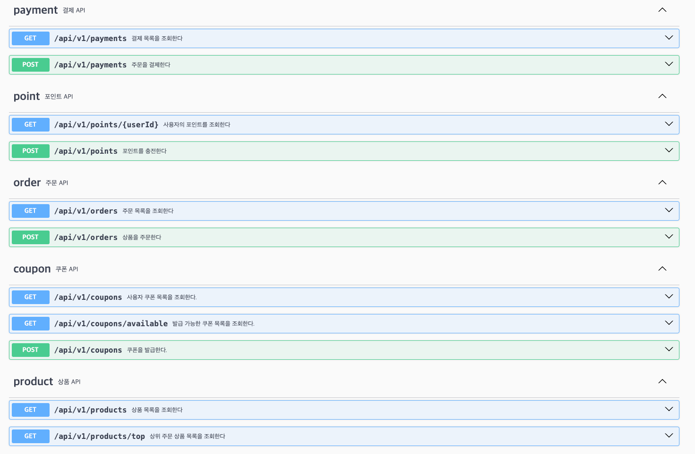

# 이커머스 서비스

## 개요
상품 주문, 쿠폰 발급, 포인트 충전 등의 기능을 제공하는 이커머스 서비스 입니다.

## 서비스 명세

### 1. 플로우 차트

플로우 차트는 [여기](./docs/flow.md)에서 확인할 수 있습니다.

### 2. 시퀀스 다이어그램

시퀀스 다이어그램은 [여기](./docs/sequence.md)에서 확인할 수 있습니다.

### 3. ERD

ERD는 [여기](docs/erdSpec.md)에서 확인할 수 있습니다.

### 4. API 명세서

API 명세서는 [여기](docs/apiSpec.md)에서 확인할 수 있습니다.

## Swagger UI 캡쳐본

자세한 명세는 [Swagger Hub](https://app.swaggerhub.com/apis/SPAKERS38/e-commerce/1.0.0)에서 확인하실 수 있습니다.

### 5. 동시성 제어 보고서
[링크](docs/concurrency.md)

### 6. Redis 사용 보고서
[링크](docs/redis.md)
