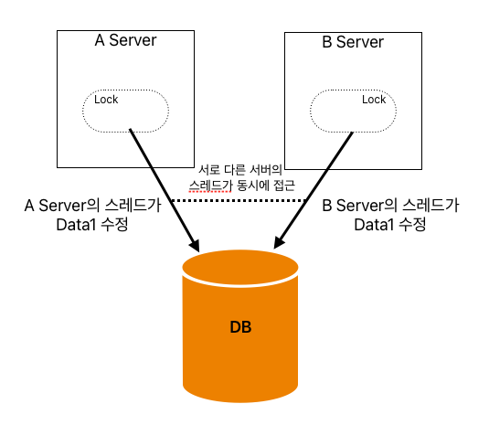

동시성 문제란 여러 프로세스 혹은 스레드에서 동시에 공유 자원에 접근할 때 발생할 수 있는 문제를 말합니다. 동시성 문제는 데이터의 일관성을 해치고, 시스템의 안정성을 저하시킬 수 있기 때문에 이를 해결하는 것은 멀티스레드 환경에서 매우 중요합니다.

동시성 문제를 알아보기 전에, 우선 알아야할 키워드가 하나 있습니다. 바로 `Race Condition (경쟁조건)`입니다.

## Race Condition (경쟁 조건)
> `경쟁 조건(Race Condition)`은 멀티 프로세스 또는 멀티 스레드 환경에서 두 개 이상의 프로세스(또는 스레드)가 **공유 자원에 동시에 접근하려고 할 때 발생**하는 상황을 말합니다. 이러한 상황에서 프로세스들 사이의 실행 순서에 따라 공유 자원의 최종 상태가 달라질 수 있으며, 이는 예측 불가능한 결과나 시스템의 오류를 초래할 수 있습니다.
>
> 참조: https://wikidocs.net/232075

여러 프로세스 혹은 스레드가 공유 자원을 두고 동시에 접근하여 각자의 로직을 정상적으로 수행하기 위해 서로 경쟁할 때 발생하는 상황이라고 보면 되겠습니다. 우리가 애플리케이션을 개발하며 마주하는 동시성 문제들은 모두 이러한 경쟁 조건 하에서 발생합니다.

경쟁 조건에 대해서 간략하게 알아보았습니다. 본격적으로 동시성 문제와 다양한 해결방법에 대해 알아보도록 하겠습니다.

### 발생하는 동시성 문제
- 분실 갱신(Lost Update)
    - 여러 트랜잭션이 동시에 데이터를 수정하면서, 특정 트랜잭션의 작업결과가 분실되는 문제입니다.
- 더티 리드(Dirty Read) = 커밋되지 않은 의존(Uncommitted Dependency)
    - 한 트랜잭션이 아직 커밋되지 않은 다른 트랜잭션의 데이터를 읽는 상황에 발생합니다.
    - 읽은 데이터를 수정했던 트랜잭션이 롤백되면, 잘못된 데이터를 가지고 이후 로직을 수행하므로 잘못된 결과가 도출됩니다.
- 비반복 읽기 (Non-Repeatable Read)
    - 한 트랜잭션에서 동일한 데이터를 두 번 읽을 때, 중간에 다른 트랜잭션이 데이터를 수정하여 서로 다른 결과를 반환하는 문제입니다.
- 팬텀 리드 (Phantom Read)
    - 한 트랜잭션에서 조건에 맞는 데이터를 읽은 후, 다른 트랜잭션이 해당 조건에 맞는 새로운 데이터를 삽입/삭제하여 결과가 달라집니다.

## 동시성 문제 해결
### 트랜잭션 격리 수준
트랜잭션의 격리 수준만 조절해도 일부 동시성 문제를 해결할 수 있습니다.

> 트랜잭션 격리 수준

| 종류               | 수준  | 설명                                  | Dirty Read | Non-Repeatable Read | Phantom Read |
| ---------------- | --- | ----------------------------------- | ---------- | ------------------- | ------------ |
| Serializable     | 높음  | 모든 트랜잭션이 순차적으로 실행되는 것처럼 동작한다.       | X          | X                   | X            |
| Repeatable Read  |     | 트랜잭션 동안 읽은 데이터는 동일한 결과를 반환하도록 보장한다. | X          | X                   | O            |
| Read Committed   |     | 트랜잭션이 커밋한 데이터만 읽을 수 있다.             | X          | O                   | O            |
| Read Uncommitted | 낮음  | 다른 트랜잭션이 아직 커밋하지 않은 데이터를 읽을 수 있다.   | O          | O                   | O            |
- Dirty Read는 Read Committed 이상의 격리 수준이면 커밋된 데이터에만 접근할 수 있기 때문에 해결됩니다.
- Non-Repeatable Read는 트랜잭션에서 동일한 데이터를 여러 번 읽을 때 동일한 결과를 반환하지 않아야 합니다. Repeatable Read가 말 그대로 Non-Repeatable Read를 해결한 수준이다. Repeatable Read 이상의 격리 수준이면 됩니다.
- Phantom Read의 경우 Serializable 수준에서 수정할 row에 DB Lock을 걸기 때문에 자연스레 해결됩니다.

> 💡주의 `Serializable` 수준은 데이터 정합성을 보장할 때 좋다. 하지만 트랜잭션이 순차적으로 진행되기 때문에 동시성이 매우 떨어진다. 따라서 트랜잭션 격리 수준 중에 성능이 가장 안 좋습니다. 실무에서는 웬만하면 최소한 Repeatable Read를 사용해야 합니다.

앞서 얘기했던 4개의 문제 중에 3개는 해결되었지만 분실 갱신은 해결하지 못했습니다. 하지만 Phantom Read는 Serializable 수준에서 해결되는데요. Serializable은 웬만하면 사용하지 않기로 하였으니, 분실 갱신과 팬텀 리드를 해결할 다른 방법을 찾아보겠습니다.

### Application 동시성 제어
나는 자바와 스프링을 사용하는 개발자이므로, 자바 스프링을 기준으로 이야기 하겠습니다.
자바에서는 동시성 문제를 해결하기 위해 `synchronized`와 `Lock` 객체를 지원합니다.

- synchronized
    - `synchronized` 키워드를 사용하는 간단한 동시성 제어 방법입니다.
    - `synchronized`가 지정된 메서드 혹은 블록에는 하나의 스레드만 진입할 수 있도록 보장해줍니다.
      ```java
      public synchronized void test() {}
      
      public void test() {
          synchronized(this) {}
      }
      ```
    - 구현이 간단하다는 장점이 있지만, 락 관련 기능이 거의 없다시피 하기 때문에 유연한 사용에는 제한이 있습니다.
- Lock 객체
    - `Lock`, `ReentrantLock` 등 락 객체를 사용하는 동시성 제어 방법입니다.
    - 락에 대한 다양한 메서드가 있기 때문에 유연한 제어가 가능합니다.


매우 간단하게 두 가지를 알아봤는데, 이 부분은 이전에도 한 번 작성한 적 있는 내용들이라 생략하겠습니다.
이 제어 방법은 간단하고 매우 효과적입니다. 한 번에 하나의 스레드만 접근할 수 있기 때문에 분실 갱신과 팬텀 리드 역시 해결됩니다.
문제는 서버 이중화의 경우입니다.
만약에 A 서버와 B 서버에 각각 동일한 주문 서버가 작동 중이라면 어떻게 될까요?



`synchronized`나 락 객체를 사용하면 하나의 애플리케이션 내에서는 동시성 제어가 가능하지만, 위와 같이 여러 애플리케이션에서 각각이 락을 가지고 동일한 DB 데이터에 접근하는 경우는 막을 수 없습니다. 즉, 동시성 문제가 발생합니다.

그러면 우리는 애플리케이션이 아닌 다른 곳에서 락을 관리할 필요가 있습니다. 바로 DB입니다.

### DB Lock
DB Lock 중 동시성 제어에 매우 중요한 두 가지 락에 대해 설명하려고 합니다. `S-lock`, `X-lock` 에 대하여 알아보겠습니다.

#### S-lock (공유락, 읽기 락)
`s-lock`은 공유락(Shared Lock), 읽기락(Read Lock) 이라고도 합니다. 데이터를 **읽기 전용**으로 만듭니다.
- 특징
    - `S-Lock`이 걸려있는 데이터는 읽을 수 있으나 수정할 수는 없습니다.
    - 여러 트랜잭션이 동시에 동일한 데이터에 대해 `S-Lock`을 걸 수 있습니다. (공유락)
    - `X-Lock`이 걸려있다면 `S-Lock`을 걸 수 없습니다.
      이러한 특징으로, 데이터를 읽는 동안 다른 트랜잭션이 해당 데이터를 수정하지 못하게 막음으로써 데이터 일관성을 보장해줍니다.
#### X-lock (배타락, 쓰기 락)
`x-lock`은 배타락(Exclusive Lock), 쓰기락(Write Lock) 이라고도 합니다. 데이터를 수정하거나 삭제할 때 사용하는 락입니다.
- 특징
    - `X-Lock`이 걸려있는 데이터는 다른 트랜잭션에서 읽을 수도, 수정할 수도, 삭제할 수도 없습니다.
    - 다른 트랜잭션은 `X-Lock` 이 걸린 데이터에 어떠한 락도 획득할 수 없습니다.
      이러한 특징으로, 데이터를 수정하는 동안 다른 트랜잭션을 읽거나 수정하지 못하게 함으로써 충돌을 방지합니다.
      `X-Lock`은 완전한 데이터 독점이므로, 동시성과 성능을 낮출 수 있습니다. 때문에 불필요한 `X-Lock`은 데드락의 위험성도 높아지기 때문에 지양하는 것이 좋습니다.


### 라킹 메커니즘
동시성 제어를 위한 주요 라킹 메커니즘에는 **낙관적 락(Optimistic Locking)** 과 비관적 락(Pessimistic Lock)이 있습니다. 이 두가지 락에 대해 알아보겠습니다.

#### 낙관적 락
낙관적 락은 앞서 알아본 DB Lock을 사용하지 않고 `version` 혹은 `timestamp` 을 사용해서 동시성을 제어하는 방법입니다. 동시성 문제 (충돌)가 발생하지 않을 것이라는 **낙관적**인 관점에서 사용하는 메커니즘입니다.

- 원리
    - 데이터를 조회할 때, 해당 데이터의 버전 정보를 가져옵니다. (1)
    - 데이터를 수정할 때, 조회한 데이터의 버전 정보를 가지고 데이터를 수정합니다. (2)
    - 버전 번호가 다르면 충돌로 간주하여 작업을 실패 처리합니다 (예외 발생)
  ```sql
      SELECT id, col, version FROM test  --- (1)
      --> id = 1, col = 1, version = 1
      UPDATE test SET col = 2 WHERE id = 1 AND version = 1 (2)
      -- Update된 row가 없다면 충돌이 발생한 것으로 간주하고 실패 처리!
  ```
- 장점
    - DB 락을 사용하지 않기 때문에 동시성을 높일 수 있고 성능적인 이점이 있습니다.
    - DB 락을 사용하지 않기 때문에 데드락이 발생하지 않습니다.
- 단점
    - 여러 요청이 동시에 발생했을 때, 하나의 트랜잭션 말고는 모두 충돌이 발생하여 에러가 발생합니다. 이 때, 개발자가 retry 로직을 구현하여야 하는 복잡함이 있습니다.
    - 충돌이 자주 발생하면 retry 로직 때문에 성능이 저하될 수 있습니다.
        - 예를 들어 100개의 쿠폰을 최악의 경우 100,000명이 "동시에" 발급 요청을 한 경우라고 해보겠습니다.
        - 처음에는 1명이 성공하고 99,999명이 실패합니다.
        - 그 다음에는 남은 99,999명 중 1명이 성공하고 99,998명이 실패합니다..
        - 계산 해보면 이렇듯 정말 최악의 경우 5,000,050,000번 DB 통신이 일어나게 됩니다.
    - 버전 관리를 위한 코드를 추가해주어야 합니다.
- 사용하는 상황
    - 충돌 가능성이 낮은 환경에서 주로 사용합니다.


#### 비관적 락
비관적 락은 DB Lock을 적극 사용하여 동시성을 제어하는 방법입니다. **충돌 가능성이 높다고 가정**하고, 데이터에 대한 접근 시점에서 다른 트랜잭션의 접근을 차단하는 방식입니다.

- 원리
    - 데이터를 읽을 때 락을 걸어 잠금을 걸어다른 트랜잭션이 접근하지 못하도록 강제합니다.
      ```sql
          SELECT id FROM test FOR UPDATE
      ```
    - 위처럼 데이터를 조회하는 시점에, 데이터를 변경하겠다는 `FOR UPDATE`를 선언하면 해당 row에 락이 걸리고, 다른 트랜잭션은 접근할 수 없게 됩니다.
- 장점
    - DB Lock을 사용하는 메커니즘이기 때문에 낙관적 락보다 통신 비용이 적습니다.
    - 버전 관리나 retry 로직 등이 필요한 낙관적 락에 비해 구현이 간단합니다.
      ```java
      // JPA 기준
      @Lock(LockModeType.PESSIMISTIC_WRITE)
      @Query("select c from Coupon c where c.id = :couponId")  
      Optional<Coupon> findByIdWithLock(@Param("couponId") Long couponId);
      ```
    - 한 트랜잭션이 작업을 완료할 때까지 다른 트랜잭션은 접근할 수 없기 때문에, 동시성 문제로부터 안전합니다.
- 단점
    - DB에 Lock을 걸기 때문에, Lock이 걸린 데이터는 단순 조회도 불가능합니다. 만약 조회가 잦은 데이터인 경우 동시성이 낮아지고 성능 병목이 발생할 수 있습니다.
    - 실제로 Lock을 걸기 때문에 데드락이 발생할 위험이 있습니다.
- 사용하는 상황
    - 충돌 가능성이 높은 환경에서 안정적인 동시성 제어를 위해 사용합니다.


---
### E-commerce와 동시성제어

- 포인트 충전
    - 포인트를 충전할 때에는 비관적 락을 사용하였습니다.
    - 따닥 눌렀을 때를 대비해서 낙관적 락을 사용하려고 하였으나 환경에 따라서 낙관적 락 역시 따닥에 대한 방어가 완벽하지 않다는 것을 인지하였습니다.
    - 어차피 둘 다 취약하다면 데이터 정합성이 중요한 "포인트" 이므로 비관적 락을 선택하였습니다.
    - 추후 Transaction Id를 사용하여 따닥에 대한 방어도 구현할 예정입니다.
- 재고 차감
    - 재고를 차감할 때에는 낙관적 락을 사용하였습니다.
    - 충돌이 많이 발생하지 않을 것이라 판단하였고, 여러 사용자가 동시에 재고를 차감할 일은 많지 않다고 생각하였습니다.
    - 동시에 그런 일이 발생한다 하더라도, retry 를 구현함으로써 성공을 시키는 것이 비관적 락으로 물리적 락을 거는 것보다 성능적인 이점이 있다고 판단하였습니다.
    - 만약 해당 상품이 엄청난 인기 상품이거나, 한정판, 타임세일 등의 이유로 충돌 가능성이 높아진다면 비관적 락으로 변경하거나 분산락을 혼합하여 사용해봐도 좋을 것 같습니다.
- 쿠폰 발급
    - 쿠폰 발급에는 비관적 락을 사용하였습니다.
    - 한정된 재고가 있는 선착순 쿠폰이니만큼 충돌 가능성이 매우 높기 때문에 데이터 정합성과 성능 어느 측면에서 보더라도 낙관적 락보다 우위에 있었습니다.