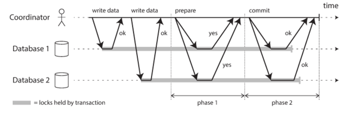
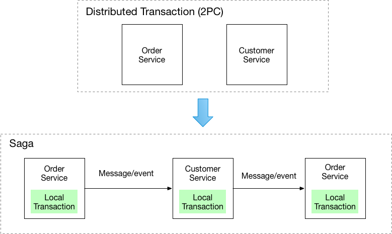
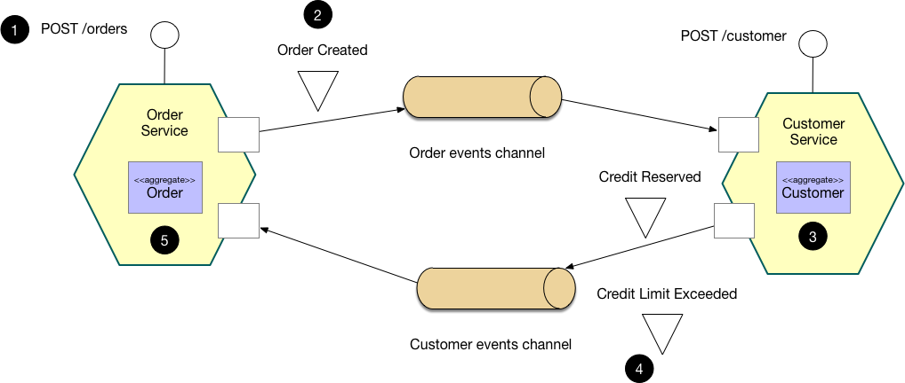
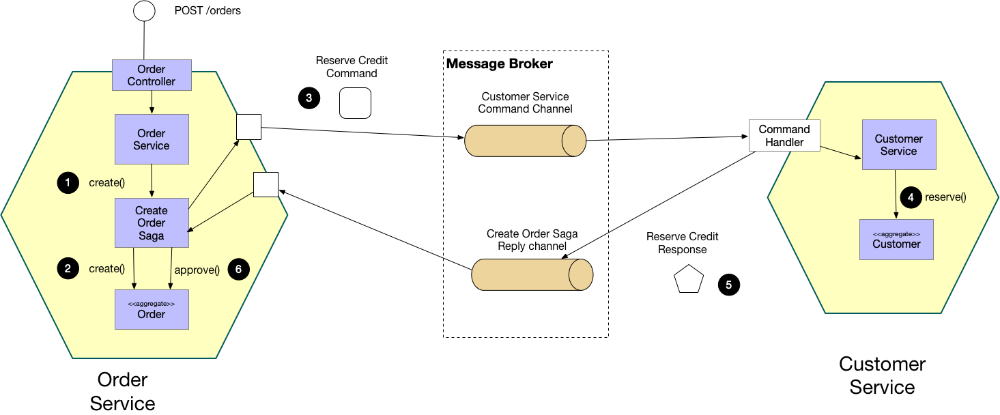

# 분산 트랜잭션의 문제와 해결방법
## 1. 개요
이 글에서는 분산 환경에서 트랜잭션을 사용할 때 마주칠 수 있는 문제들과, 이를 해결할 수 있는 다양한 방법들에 대해 알아보겠습니다.

보통 데이터베이스 트랜잭션은 ACID의 원칙에 따라 운영됩니다.
여기에는 다음과 같은 특성이 포함됩니다:

- 원자성(Atomicity)
- 일관성(Consistency)
- 독립성(Isolation)
- 지속성(Durability)

그중에서도 원자성은 아주 중요한 개념입니다.

> 원자성이란, 하나의 트랜잭션 안에 있는 작업들이 중간에 일부만 실행되는 일이 없이 모두 성공하거나 모두 실패하도록 보장하는 것을 말합니다. 
> 
> (참고: ACID - 위키피디아)

단일 DB 환경에서는 원자성이 자연스럽게 보장되지만, 여러 서비스와 DB가 엮인 분산 환경에서는 이게 쉽지 않습니다.
다음 섹션에서는 분산 환경에서 발생하는 문제들을 살펴보고, 그 해결 방법에 대해 설명하겠습니다.

## 2. 분산환경에서의 트랜잭션 문제
분산 환경이라 함은 예를 들어, 마이크로서비스 아키텍처(MSA)처럼 여러 서비스가 각자의 데이터베이스를 운영하는 경우를 말합니다.
예를 들어, E-commerce 시스템에서는 주문, 결제, 쿠폰, 포인트 등 서비스가 각각 독립된 DB를 사용할 수 있습니다.

이런 상황에서는 다음과 같은 문제들이 발생할 수 있습니다.

### 2.1. 네트워크 지연 및 불안정성
- 문제점:
  - 지연(Latency): 서비스 간 통신이 네트워크를 거치다 보니 응답 시간이 길어져 전체 트랜잭션 실행 시간이 늘어날 수 있습니다.
  - 불안정성: 네트워크 장애나 패킷 손실 같은 문제가 발생하면 일부 서비스와의 연결이 끊겨 트랜잭션 중간에 오류가 생길 위험이 있습니다.
- 영향: 일부 서비스에서는 작업이 성공했지만, 다른 서비스에서는 실패하는 경우가 생겨 전체 트랜잭션의 원자성을 보장하기 어려워집니다.

### 2.2. 원자성 보장의 어려움
단일 데이터베이스에서는 DBMS가 원자성을 보장하지만, 여러 DB를 아우르는 분산 환경에서는 문제가 달라집니다.

- 문제점: 한 서비스에서는 작업이 성공했는데 다른 서비스에서는 실패하면, 전체 트랜잭션을 어떻게 롤백할지 결정하기 어렵습니다. 일부 작업만 성공하고 나머지가 실패하면 데이터 불일치가 발생할 수 있습니다.

### 2.3. 트랜잭션 관리의 복잡성
각 서비스가 독립적으로 운영되며 서로 다른 데이터 저장소를 사용할 경우, 전체 트랜잭션을 조율하는 로직이 매우 복잡해집니다.

- 문제점: 예를 들어, 2-Phase Commit(2PC) 같은 프로토콜을 도입하면, 각 노드와 동기화하고 실패 상황을 복구하는 로직이 추가되어 시스템이 복잡해집니다.
중앙에서 트랜잭션 상태를 관리할 경우, 중앙 관리자가 병목 현상이나 단일 장애점(SPOF)이 될 위험이 있습니다.

### 2.4. 데이터 일관성 및 동기화 문제
여러 데이터 저장소의 데이터를 동시에 일관되게 유지하는 건 쉽지 않습니다.

- 문제점:
각 서비스의 데이터 업데이트 시점이 다르면 일시적으로 데이터 불일치가 생길 수 있습니다.
동기화를 위해 추가 작업이 필요해지면 성능 저하나 충돌 해결 문제가 발생할 수 있습니다.

- 예시:
E-commerce 시스템에서 주문, 결제, 쿠폰, 포인트 서비스가 각각 다른 DB를 사용하면, 결제 성공 후 쿠폰 사용 내역이나 포인트 적립 내역이 바로 반영되지 않아 고객 혼란이 올 수 있습니다.

## 3. 분산 트랜잭션의 해결 방법
분산 환경에서 발생하는 문제들을 해결하기 위해 주로 사용되는 두 가지 방법이 있습니다.

### 3.1. 2-Phase Commit (2PC)
2-Phase Commit, 줄여서 2PC는 트랜잭션 커밋을 두 단계로 나누어 진행하면서 원자성을 보장하는 방식입니다.

동작 방식:

1. 준비 단계(Prepare Phase): 참여하는 모든 노드에게 커밋 가능 여부를 확인합니다.
2. 커밋 단계(Commit Phase): 모든 노드가 준비 완료를 보고하면, 최종적으로 커밋을 실행합니다.

- 장점: 모든 노드의 상태를 미리 확인하므로 원자성을 보장할 수 있습니다.
- 단점: 네트워크 지연이나 특정 노드 장애 발생 시 전체 트랜잭션이 지연되거나, 락이 걸려 시스템 성능에 영향을 줄 수 있습니다.

### 3.2. Saga Pattern
Saga 패턴은 하나의 큰 트랜잭션을 여러 개의 작은 로컬 트랜잭션으로 나누고, 각 단계에서 문제가 발생하면 보상 트랜잭션을 통해 이전 작업을 취소하는 방식입니다.

Saga 패턴에는 두 가지 주요 방식이 있습니다.

#### 3.2.1. Choreography Saga
각 서비스가 자신의 로컬 트랜잭션을 수행한 후, 이벤트를 통해 다음 작업을 자동으로 호출하는 방식입니다.

- 특징:

  - 분산형 제어: 중앙 관리자가 없어서 각 서비스가 독립적으로 동작하고, 결합도가 낮습니다.
  - 높은 확장성: 서비스 간 의존성이 줄어들어 시스템 확장이 용이합니다.
  
- 단점:
  - 전체 트랜잭션의 흐름을 중앙에서 관리하기 어려워 모니터링이나 디버깅이 복잡해질 수 있습니다.
  - 이벤트 전달 과정에서 누락, 중복, 순서 보장이 문제될 수 있습니다.
  
#### 3.2.2. Orchestration Saga
중앙의 Saga Orchestrator가 전체 트랜잭션 흐름을 제어하는 방식입니다. 각 로컬 트랜잭션을 순차적으로 호출하며, 문제가 생기면 보상 트랜잭션을 실행해 이전 작업을 취소합니다.

- 특징:

  - 중앙 집중식 관리: 전체 트랜잭션 흐름을 한눈에 파악할 수 있어 관리가 쉽습니다.
  
  - 명확한 제어: Orchestrator가 각 단계와 보상 로직을 관리하여 일관된 실패 대응이 가능합니다.
  
- 단점:
  - 중앙 Orchestrator가 장애 발생 시 전체 Saga가 중단될 수 있으므로, 고가용성이나 이중화가 필요합니다.

#### 3.2.3. 두 방식의 비교 및 선택 기준
- 제어 방식:
  - Orchestration: 중앙에서 전체 흐름을 관리하기 때문에 명확하지만, 단일 장애점 문제가 있을 수 있습니다.
  - Choreography: 서비스 간 독립성이 높아 확장성은 좋으나, 전체 흐름 관리 및 모니터링이 어려울 수 있습니다.
  
- 시스템 복잡성:
  - Orchestration: 구현이 단순하고 중앙에서 보상 로직을 관리합니다.
  - Choreography: 각 서비스에 로직이 분산되어 있어 구현 복잡성과 이벤트 관리가 중요합니다.
  
- 장애 대응:
  - Orchestration: 중앙 Orchestrator를 이중화하면 장애에 효과적으로 대응할 수 있습니다.
  - Choreography: 장애가 발생해도 특정 서비스에만 영향을 줄 수 있지만, 전체 상태 파악이 어렵다는 단점이 있습니다.

## 4. 결론
분산 환경에서 트랜잭션을 처리하는 일은 단일 DB 환경보다 훨씬 복잡합니다. 네트워크 지연, 데이터 일관성 문제, 관리 복잡성 등 여러 어려움이 있지만, 2-Phase Commit이나 Saga 패턴 같은 기법을 통해 문제를 효과적으로 해결할 수 있습니다.
각 방법은 장단점이 있으므로, 시스템의 특성과 요구사항에 맞춰 적절한 방식을 선택하는 것이 중요합니다.