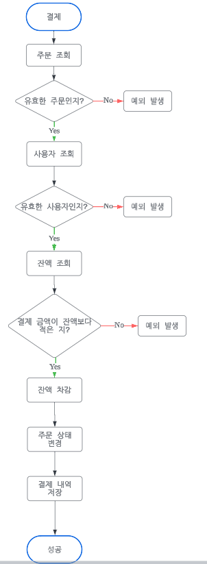

# e-commerce flow chart

## 개요
이커머스 서비스 개발을 위한 플로우 차트 목록입니다.

## 목차
1. [잔액 충전](#1-잔액-충전)
2. [잔액 조회](#2-잔액-조회)
3. [상품 목록 조회](#3-상품-목록-조회)
4. [쿠폰 발급](#4-쿠폰-발급)
5. [사용자 쿠폰 목록 조회](#5-사용자-쿠폰-목록-조회)
6. [발급 가능한 쿠폰 목록 조회](#6-발급-가능한-쿠폰-목록-조회)
7. [주문](#7-주문)
8. [결제](#8-결제)
9. [주문 내역 조회](#9-주문-내역-조회)
10. [사용자별 결제 내역 조회](#10-사용자별-결제-내역-조회)
11. [상위 상품 조회](#11-상위-상품-조회)

## Flow Chart
### 1. 잔액 충전

[목차로 돌아가기](#목차)

### 2. 잔액 조회

[목차로 돌아가기](#목차)

### 3. 상품 목록 조회

[목차로 돌아가기](#목차)

### 4. 쿠폰 발급

[목차로 돌아가기](#목차)

### 5. 사용자 쿠폰 목록 조회

[목차로 돌아가기](#목차)

### 6. 발급 가능한 쿠폰 목록 조회

[목차로 돌아가기](#목차)

### 7. 주문

[목차로 돌아가기](#목차)

### 8. 결제

[목차로 돌아가기](#목차)

### 9. 주문 내역 조회

[목차로 돌아가기](#목차)

### 10. 사용자별 결제 내역 조회

[목차로 돌아가기](#목차)

### 11. 상위 상품 조회

[목차로 돌아가기](#목차)
