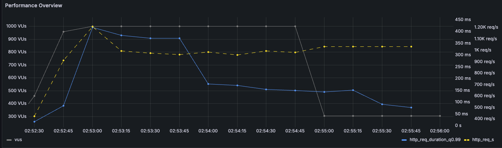
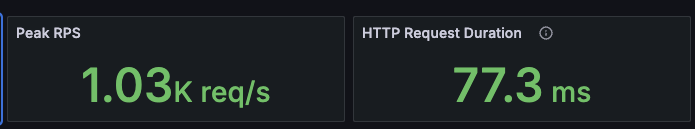
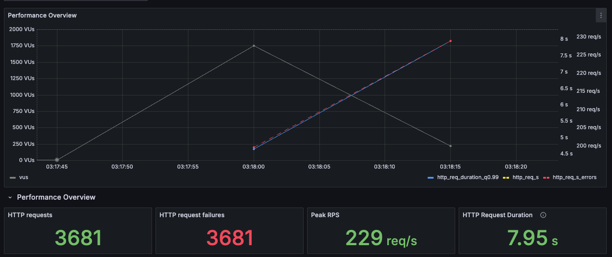
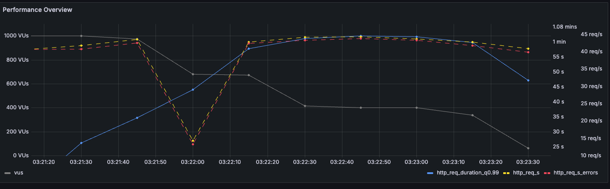
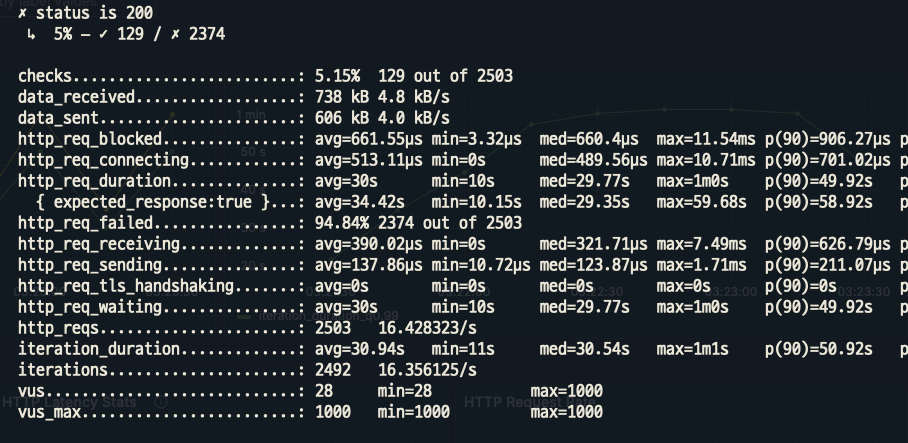
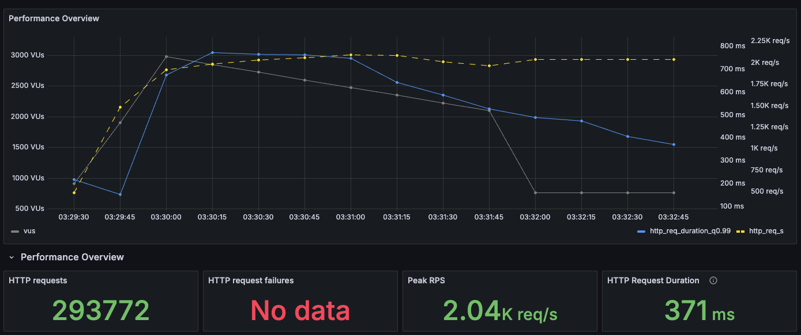
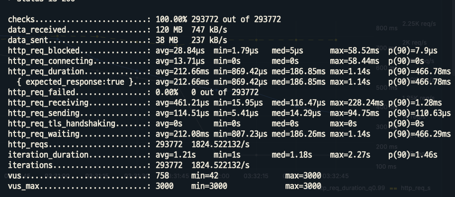

# 부하테스트 수행 및 분석

## 1. 개요
본 보고서는 다양한 부하 테스트 시나리오를 통해 시스템의 성능 지표를 분석하고, 병목 현상을 유발하는 부분을 식별하여 개선 방안을 제안하는 데 목적이 있습니다. 각 테스트 케이스에 따른 결과와 분석을 통해 실제 운영 환경에서 발생할 수 있는 이슈를 미리 파악하고, 효과적인 대응 방안을 마련하고자 합니다.

## 2. 테스트 환경
### 2.1. 테스트 대상
이전 보고서에서 테스트 대상을 다음과 같이 정했습니다.

1. **부하가 집중되는 API**
    - 상품 목록조회
    - 쿠폰 발급
2. **병목이 예상되는 API**
    - 상품 주문
3. **Slow query가 예상되는 API**
    - 상위 주문 상품 조회
### 2.2 서버 및 인프라 환경

- **CPU:** 4코어 (4스레드)
- **메모리:** 16GB RAM
- **운영체제:** Docker 기반 Linux 환경
- **Web 서버:** nginx
- **애플리케이션 서버:** Spring Boot
- **데이터베이스:** MySQL
- **모니터링:** Prometheus (메트릭), Grafana (대시보드)
- **부하 테스트 툴:** K6
- 메트릭: Prometheus
- 모니터링: Grafana
- 부하테스트 툴: K6

## 3. 테스트 결과 및 분석
### 3.1. 상품 목록 조회 테스트
#### 시나리오
1. VU(Virtual User)를 1000명으로 30초간 서서히 증가
2. VU를 2000명으로 20초간 증가
3. VU를 1000명으로 2초간 감소
4. VU를 1000명으로 2분간 유지

#### 결과 지표



#### 분석
  - VU 1000명 구간에서 RPS(Requests Per Second)가 약 1000에 달하여 모든 사용자의 요청을 동시에 처리할 수 있는 능력을 확인했습니다.
  - HTTP 요청 응답 시간은 평균 77.3ms로 양호한 성능을 나타냈습니다.
  - 상품 목록 조회가 Redis로 캐싱되어 있기 때문에 보다 빠른 속도로 응답받을 수 있었다.
### 3.2. 쿠폰 발급
#### 시나리오
1. 1초간 2000명의 VU을 단시간에 발생시킵니다.
2. 10초간 10,000명의 VU로 증가시킵니다

#### 결과 지표


#### 분석
  - 모든 요청이 실패하였습니다.
  - VU 수와 관계없이 요청 실패율이 비례적으로 증가하는 현상을 통해, 쿠폰 발급 로직에 치명적인 결함이 있음을 확인할 수 있었습니다.
  - 해당 문제에 대해서는 로직의 안정성 및 병목 현상을 초래하는 원인에 대해 추가적인 코드 리뷰와 개선 작업이 필요합니다.

### 3.3. 상품 주문

#### 시나리오
1. VU를 400명으로 10초간 서서히 증가시킵니다.
2. VU를 1000명으로 2초간 급작스럽게 증가시킵니다.
3. VU가 다시 400명으로 서서히 1분간 감소합니다.
4. VU가 400명으로 1분간 유지됩니다.
####  결과 지표


- 분석
  - 전체 2500건 중에 5.15%만 성공하고, 나머지는 DB 커넥션 타임아웃이 발생하였습니다.

  - 로그에서 확인된 에러 메시지:
    ```
    java.sql.SQLTransientConnectionException: HangHaePlusDataSource - Connection is not available, request timed out after 10000ms (total=10, active=10, idle=0, waiting=200)
    ```
  - 주문 로직의 특성 상 트랜잭션의 범위가 크고, 커넥션 풀이 작아 타임아웃이 발생한다고 판단하였습니다.
  - 이를 개선하기 위해 주문 로직을 이벤트 기반 아키텍처로 변경하고, 보상트랜잭션을 도입하면 많이 개선될 것이라 예상됩니다.

### 3.4. 상위 주문 상품 조회

#### 시나리오
1. VU를 2000명으로 30초간 서서히 증가시킵니다.
2. VU가 3000명으로 10초간 급작스럽게 증가합니다.
3. 2000명 VU를 2분간 유지합니다.
#### 결과 지표



#### 분석
- 모든 요청이 성공한 점에서 안정성 측면은 양호한 편으로 보입니다.
- 평균 371ms로 상대적으로 높은 편이며, p95 기준 약 1초 이상 소요되고, 최대 4초를 초과하는 요청도 존재했습니다. 이는 해당 API가 복잡한 조회 로직을 포함하거나 대량의 데이터를 처리하는 과정에서 병목이 발생했을 가능성이 있습니다.
- 피크 시점에 약 2,000 req/s를 유지하면서도 실패 없이 응답을 반환한 점은 긍정적이나, 응답 시간 분포가 넓고 일부 구간에서 지연이 발생하고 있으므로, 과부하 상황에서 사용자 경험이 저하될 수 있습니다.

## 4. 결론 및 개선 방안
테스트 결과를 종합하면, 시스템은 일부 기능에서 안정적인 성능을 보이나, 상품 주문 및 실시간 쿠폰 발급과 같이 트랜잭션 범위가 크거나 대용량의 트래픽이 한 번에 몰리는 API에서는 병목 및 타임아웃 문제가 드러났습니다.

추후, 개선할 점들을 나열하며 본 보고서를 마무리하겠습니다.
- **상품 주문 로직 개선:**  
  이벤트 기반 아키텍처를 적용하여 트랜잭션을 최대한 분리하여 사용자에게 빠르게 응답해줄 수 있도록 합니다.
- **트랜잭션 및 커넥션 풀 관리:**  
  주문 API의 트랜잭션 범위를 재검토하고, 필요 시 커넥션 풀 확장과 타임아웃 설정을 조정합니다.

- 쿠폰 발급과 레디스:
  실시간 쿠폰 발급 로직에 레디스를 적용하여, 빠르게 응답할 수 있도록 진행합니다.
- 코드 개선 및 디버깅:
  성능 상의 개선 이외에도 문제가 되는 로직을 수정하도록 합니다.