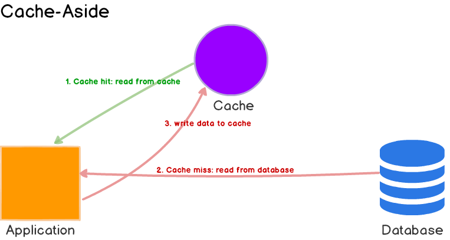
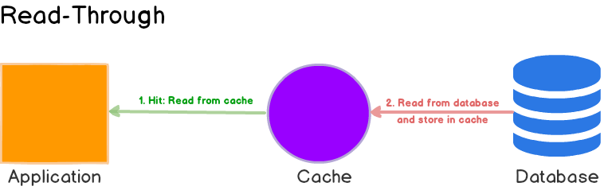
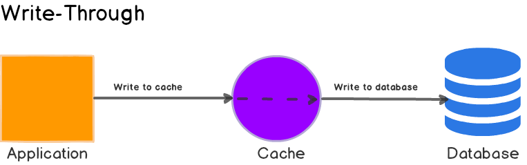

# Redis 사용 보고서

> Redis(Remote Dictionary Server)는 주로 애플리케이션 캐시 또는 빠른 응답 데이터베이스로 사용되는 오픈 소스, 인메모리, NoSQL 키/값 저장소입니다.
>
> 참조: https://www.ibm.com/think/topics/redis

## 개요
Redis는 그 이름에 Dictionary가 포함된 만큼, key-value 형태가 특징인 저장소입니다. Redis가 캐시, 빠른 응답 등으로 사랑받는 이유는 바로 "인메모리"라는 특성에 있습니다.
우리가 보통 애플리케이션에서 사용하는 데이터 저장소는 RDBMS(관계형 데이터베이스)입니다. 이들은 데이터를 **디스크**에 저장합니다. 반면, Redis는 데이터를 **메모리**에 저장합니다. 이들은 무슨 차이가 있을까요?

컴퓨터에는 CPU, 메모리, 디스크(HDD, SDD)가 있는데요. CPU에서 어떤 로직을 연산하기 위해서는 연산할 데이터들이 필요합데, 이 데이터들은 기본적으로 디스크에 저장되어 있습니다. 이 데이터들을 CPU에서 사용하기 위해 메모리로 가져옵니다. 메모리는 디스크보다 CPU와 가깝고 빠르기 때문이죠. 실제로 데이터를 가져올 때 디스크에서 가져오는 것과 메모리에서 가져오는 것은 굉장한 속도 차이가 납니다.

따라서 굳이 성능을 따지자면 메모리에 접근하는 것이 월등하게 좋습니다. 그러면 이렇게 생각할 수도 있습니다. "그럼 디스크말고 메모리만 사용하면 되는 것 아닌가?" 하지만 메모리에는 큰 단점이 있습니다. 메모리는 **휘발성**이며 디스크에 비해 용량이 작다는 것입니다. 디스크는 데이터 영속이 가능하지만 메모리는 서버 혹은 컴퓨터가 종료될 때 휘발됩니다. 이러한 메모리의 특징들을 인메모리 저장소인 Redis가 그대로 가집니다.

위의 특징들을 정리해보면, 데이터 저장에 메모리를 사용하는 Redis는 디스크를 사용하는 저장소(ex. RDBMS)보다 월등히 빠릅니다. 하지만 데이터가 휘발성이며 디스크보다 저장 가능 용량이 월등히 적습니다. 따라서 Redis는 휘발되지 않아야할 중요한 데이터를 저장하거나, 대용량의 데이터를 저장하는 데에 부적합합니다.

이러한 특징들로 인해 Redis는 주로 캐시, 세션, 락 등을 구현하는 데에 사용합니다. 뿐만 아니라 다양한 자료구조를 지원하여 동시성을 제어하거나 메시지 큐의 역할을 하기도 합니다. 이번 보고서에서는 해당 e-commerce 프로젝트에서 Redis를 적용할 수 있는 부분들을 알아보고, 분석해보고자 합니다.
  
---  

## 그럼 Redis는 어디 써야할까?
앞서 개요에서 말했듯 Redis는 인메모리 저장소이기 때문에 용량이 적고, 속도가 빠른 특징이 있습니다. 이러한 특징을 가진 Redis는 어떤 상황에 도입하면 좋을까요?

### 분산 환경에서의 세션 관리
가장 먼저, 속도가 빠르고 휘발성인 Redis는 임시 세션 데이터를 저장하는 데 적격입니다. 세션 데이터는 사용자가 애플리케이션을 사용 중일 때만 임시로 저장해두었다가, 로그아웃 혹은 세션 만료 시 사라지게 되는 데이터입니다. 물론 애플리케이션 메모리로도 세션을 관리할 수 있지만, 분산 환경에서는 사용자의 요청이 어떤 애플리케이션 인스턴스를 호출할 지 알 수 없으므로 Redis와 같은 외부 저장소를 사용하는 것이 좋습니다.

### 캐싱
속도가 빠르고 휘발하는 데이터는 캐시로 사용하기에 매우 적합합니다. 그 전에 캐시가 무엇인 지 알아볼까요?
> 캐시(cache, 문화어: 캐쉬, 고속완충기, 고속완충기억기)는 컴퓨터 과학에서 데이터나 값을 미리 복사해 놓는 임시 장소를 가리킨다.
>
> 참조: https://ko.wikipedia.org/wiki/%EC%BA%90%EC%8B%9C

**캐싱**은 이러한 캐시를 사용하는 것을 의미합니다. 캐싱을 하는 것은 **빠른 처리**를 위한 **임시 저장소**입니다. Redis 역시 속도가 빠른 임시 저장소(휘발성)입니다. 따라서 Redis는 캐시 역할에도 적격입니다. 대부분의 Redis 이용자는 Redis를 캐시로 사용합니다.

> 💡 잠깐, 알아두고 넘어갈 것이 있습니다. 캐시를 다룰 때에 중요한 특성인 **캐시의 지역성**이 그 주인공입니다. 간단하게 알아보고 넘어가겠습니다.
> #### 캐시의 지역성
> 캐시의 지역성(Locality of Cache)은 데이트를 효율적으로 저장하고 빠르게 접근하기 위한 개념으로, 특정 데이터가 한 번 참조되었을 때 이후에도 가까운 시점이나 위치에서 다시 참조될 가능성이 높다는 원리를 의미합니다. 캐시 지역성은 크게 **시간 지역성(Temporal Locality)** 과 **공간 지역성(Spatial Locality)** 로 나뉩니다.
> - **시간 지역성(Temporal Locality)**  
  시간 지역성은 최근 사용된 데이터는 다시 사용될 가능성이 높다는 개념입니다. 예를 들어 특정 데이터가 캐싱되면, 이후 같은 데이터를 조회할 때 캐시에 남아있는 데이터가 빠르게 반환될 수 있습니다. 따라서, 반복적인 조회나 자주 조회되는 정보들은 시간 지역성을 이용하면 효율적으로 조회할 수 있습니다.
> 
> 
> - **공간 지역성(Spatial Locality)**  
  공간 지역성은 참조된 데이터와 가까운 위치에 있는 데이터가 곧 접근될 가능성이 높다는 개념입니다. 특정 데이터가 캐싱되면, 해당 데이터와 관련된 다른 데이터가 함께 접근될 가능성이 높습니다. 예를 들어, 공간 지역성을 이용하여 상품이 조회될 때 해당 상품에 대한 리뷰나 관련 정보를 함께 캐싱하면 효율적으로 조회할 수 있습니다.

#### 캐싱을 사용하면 좋은 로직의 특징

캐싱은 다음과 같은 상황등에 적용하면 좋습니다.

- 데이터의 수정보다 조회가 현저하게 많은 경우
- 조회할 때마다 복잡한 계산이 필요한 경우
- 한 번 조회할 때 오래걸리는 경우

### 실시간 데이터 처리
Redis는 매우 빠른 저장소입니다. 하지만 다른 DB처럼 단순 저장소 역할만 하는 것은 아닙니다. Redis는 다양한 기능을 가진 자료형을 지원합니다.  

> 다양한 자료형에 대한 설명은 Redis 공식문서(https://redis.io/docs/latest/develop/data-types)를 확인해주시기 바랍니다. 
 
뿐만 아니라, Redis는 채널을 이용한 Pub-Sub 기능도 지원합니다.  
이로써 실시간 채팅 시스템, 실시간 랭킹 시스템 등에 활용할 수 있습니다.

### 비동기 작업 큐
Redis의 List 자료형이나 Pub/Sub을 사용하면 간단한 비동기 작업 큐도 구현할 수 있습니다.

### 분산 락
Redis는 싱글 스레드이며, 원자적으로 데이터를 연산합니다. 따라서 임계 영역이 발생하지 않고, 동시성을 자체적으로 잘 제어해주는 특징을 가집니다. 이러한 특성을 이용하여, 분산 환경에서 사용할 수 있는 락을 구현할 수 있습니다.

Redis는 위 기능들 이외에도 빠른 속도와 휘발되는 특성을 이용하여 다양한 상황에서 활용할 수 있습니다.
  
---  
## E-Commerce에서의 Redis 적용

### 적용 대상

#### 상품 목록 조회
상품 목록은 일반적으로 수정보다는 조회가 훨씬 많습니다. 또, 상황에 따라 조회가 오래걸릴 수도 있습니다. 하지만 모든 상황에 캐싱을 적용하는 것은 좋지 않습니다. 

현재 프로젝트에는 상품 목록 조회 시 상품명과 가격으로 필터링하여 조회가 가능한데, 이 모든 경우에 캐싱을 하게 되면 Redis에 저장되는 데이터가 많아질 것이고 물론 휘발성이지만 결국 레디스 혹은 메모리에 부하가 발생할 수 있습니다.

따라서, 성능 상의 이점을 얻기 위해서는 필터링 없는 전체 상품 목록 검색 결과만을 캐싱하는 것이 좋겠습니다.
#### 상위 주문 상품 조회
상위 주문 상품 조회 기능은 복잡한 쿼리를 사용한 집계가 필요한 로직입니다. 현재 프로젝트에서 상위 주문 상품 조회는, 1일전 ~ 3일전의 주문에 대하여 주문량이 많은 상품의 순위를 매겨 조회하는 기능입니다.

따라서, 오늘 조회하는 상위 주문 상품은 오늘 하루동안 동일한 데이터가 조회되면 됩니다. 휘발성인 Redis를 캐시로 사용하기 딱 좋아보이네요!

TTL(Time To Live)을 하루로 하여, 매일 특정 시간에 상위 주문 상품을 한 번만 계산해 캐싱해두면 좋겠습니다.
#### 선착순 쿠폰 발급
우선 선착순 쿠폰 발급은 조회가 아니므로 캐싱으로 사용되는 것이 아니라 **실시간 데이터 처리** 에 해당한다고 볼 수 있겠습니다.

이 경우 Redis를 단순 캐싱용으로만 사용하는 것이 아니기 때문에 다양한 해결 방법이 다양합니다. 저는 Redis의 `Strings` 자료형을 사용하는 방법과 `Sorted Set` 자료형을 사용하는 방법을 고려했습니다.

##### (1) Strings 사용
- 방법
  - 쿠폰 ID와 쿠폰 개수를 key로 가지고 value를 0으로 시작하여, 쿠폰 발급 마다 `INCR`를 사용하여 원자적으로 증가시킵니다. 혹은 value를 쿠폰 발급 개수로 시작하여 0이 될 때 까지 `DECR`을 사용하여 원자적으로 감소시킵니다.
  - 쿠폰 발급이 성공하면 쿠폰 발급 관련 DB를 업데이트 합니다.
  - 쿠폰 발급 시 초과 발급 되면, 더 이상 로직이 진행되지 않고 예외가 발생하도록 유도합니다.
- 장점
  - 매우 간단하고, 깔끔하며 확장성 있습니다.
  - 원자적 연산이 보장되므로, 동시성 제어가 간단하고 강력합니다.
- 단점
  - 기능이 한정적입니다.
  - 동일 유저의 쿠폰 중복 발급에 대해 추가 예외처리가 필요합니다.

##### (2) Sorted Set 사용
>***Sorted Set***은 Set이기 때문에 기본적으로 중복이 불가능한 집합입니다. 다들 아시다피시 Set은 원래 순서라는 것이 없습니다. ***Sorted Set*** 은 Set에 무려 순서를 넣어줍니다!  
Redis의 ***Sorted Set***은 `score`(가중치)를 활용하여 값의 순서를 보장합니다. 정리하면 하나의 `key`에서 여러 `value`가 집합으로 있을 때, 각 `value`는 고유의 `score`를 가지게 되고 이 `score`에 따라 `value`의 순서가 결정됩니다.
>
>`score`에는 64비트 부동 소수점 숫자(double)이 들어갑니다.
>
> 참조: (https://redis.io/docs/latest/commands/zadd/)

- 방법
  1. 쿠폰 발급 요청이 들어오면 Sorted Set에 `coupon:1(id):requests`를 key로, userId를 value로 하여 `ZADD` 합니다. 이 때, `score`는 로직을 수행하는 타임스탬프입니다.
  2. 스케줄러는 특정 시간(ex. 5초)마다 비동기적으로 돌며 DB로 부터 쿠폰 재고를 조회합니다. `coupon:1(id):issued` Sorted Set에 `ZCARD`를 호출하여 현재 발급된 인원을 조회합니다.
  3. 발급 가능한 인원을 계산한 뒤, `coupon:1(id):requests`에서 발급 가능한 인원만큼 `ZRANGE`하여 쿠폰 발급(DB)을 진행합니다.
  4. 발급이 완료되면, `coupon:1(id):issued`에 저장됩니다.
  > 만약 레디스가 죽었다면 RDB에서 직접 조회합니다.
- 장점
  1. 대규모 트래픽이 한 번에 쿠폰 발급이 요청이 온 경우, 각 요청은 DB를 사용할 필요 없이 Redis에 `ZADD`만 하면 되므로 부하가 굉장히 줄어듭니다.
  2. 기본적으로 Set이기 때문에 쿠폰 중복 발급이 방어됩니다.
  3. 기능이 풍부하고, `coupon:1(id):issued`을 활용하여 다양한 작업을 할 수 있습니다.
- 단점
  1. 스케줄러를 사용해야하기 떄문에 구현이 복잡합니다.
  2. 타임스탬프로 선착순을 관리하는데, 만약 타임스탬프가 완전 동일한 발급 요청인 경우에 사전순으로 발급이 됩니다.
  3. 스케줄러 사용 시 발급 요청이 없더라도 DB와 통신이 필요할 수도 있습니다.

저는 `Sorted Set`을 사용하여 쿠폰 발급 요청을 최적화해보려고 합니다. 기존에는 Redis 분산락이 적용되어 있었고, 기능에는 문제가 없었습니다. 하지만 Lock이라는 것은 동시성을 해칠 수 있습니다. 정말 대규모의 요청이 한 번에 들어오는 경우 모든 요청에 대해 락을 건다는 것은 성능 저하로 이어질 수 있습니다.  
그러한 관점에서 대규모 트래픽이 들어오더라도 `ZADD`만 하여 동시성을 극대화하는 `Sorted Set` 사용을 채택하였습니다.

### 적용 캐싱 전략
앞서, 캐싱을 적용할 대상을 정했습니다. 이제 아무렇게나 캐싱하면 될까요?

그렇지 않습니다. 캐싱을 할 때에 캐싱 전략을 정하는 것은 굉장히 중요합니다. 올바르게 캐싱을 구현하면 응답 시간을 단축하고 데이터베이스의 부하를 줄이며 비용을 절감할 수 있습니다. 

다양한 캐싱 전략이 존재하며, 적절한 전략을 선택하는 것이 중요합니다. 캐싱 전략은 데이터와 데이터 접근 패턴, 즉 데이터의 쓰기와 읽기 방식에 따라 달라집니다. 적용할 전략을 선택하기 전에 어떤 전략이 있는 지 먼저 간단하게 알아보겠습니다.
#### 읽기 전략
##### 1. Cache-Aside (Look-Aside)
Cache-Aside 전략은 "캐시를 옆에 두고 사용한다"라고 볼 수 있습니다. 가장 일반적인 캐시 읽기 전략입니다. 캐싱된 데이터가 있으면 해당 데이터를 바로 조회하고, 없으면 DB에서 조회한 뒤 캐시를 업데이트 합니다.

(출처: https://codeahoy.com/2017/08/11/caching-strategies-and-how-to-choose-the-right-one/)

Cache-Aside의 흐름은 다음과 같습니다.
1. 데이터를 조회할 때, 캐시에서 **먼저** 찾습니다.
2. 캐시에 해당 데이터가 있다면(Cache hit) 해당 데이터를 바로 반환합니다.
3. 캐시에 해당 데이터가 없다면(Cache miss) 해당 데이터를 DB에서 조회하고, 조회된 데이터를 캐시에 업데이트합니다.

Cache-Aside 전략은 Redis에 문제가 발생하는 등 캐시가 정상 작동하지 않는 경우에도 DB를 조회하면 되기 때문에 안전하게 사용할 수 있다는 장점을 가집니다. 또한, 애플리케이션에서 캐싱을 하기 때문에 DB 데이터의 구조와는 상관없이 원하는 구조로 변환하여 캐싱을 할 수 있다는 장점이 있습니다.

하지만 Cache-Aside는 캐시와 DB간의 데이터 일관성이 떨어질 수 있습니다. 예를 들어, DB에 데이터 수정이 일어났어도 Cache hit라면 수정 전 데이터가 반환됩니다. 이를 해결하기 위해 쓰기 전략과 캐시 무효화 전략을 잘 세우는 것이 중요합니다.
##### 2. Read-Through
Read-Through 전략은 애플리케이션과 캐시 그리고 DB를 일렬로 나열하여, 애플리케이션에서는 캐시만 조회하도록 하는 전략입니다.

(출처: https://codeahoy.com/2017/08/11/caching-strategies-and-how-to-choose-the-right-one/)

Read-Through의 흐름은 다음과 같습니다.
1. 데이터를 조회할 때, 캐시에서 찾습니다.
2. 캐시에 해당 데이터가 있다면(Cache hit) 해당 데이터를 바로 반환합니다.
3. 캐시에 해당 데이터가 없다면 (Cache miss) 캐시 라이브러리나 Provider가 DB에서 캐시를 업데이트합니다.

Cache-Aside와 Read-Through의 차이점은, 캐시 업데이트의 주체입니다. Cache Miss가 발생했을 때 Cache-Aside는 애플리케이션이 DB에서 직접 조회하여 캐시를 업데이트 하지만, Read-Thorugh에서의 애플리케이션은 그저 캐시만을 바라봅니다. 누가 어떻게 업데이트하는 지는 몰라도 됩니다.

Read-Through의 치명적인 단점은, 데이터 조회 시 캐시에만 의존하므로 Redis에 문제가 생기면 데이터를 조회할 수 없다는 점입니다. 또한, 캐싱되는 데이터의 구조는 DB에서 사용되는 데이터 구조를 따라야 합니다.

#### 쓰기 전략
##### 1. Write-Through
Write-Through 전략은  애플리케이션과 캐시 그리고 DB를 일렬로 나열하여, 애플리케이션에서는 캐시만 업데이트하도록 하는 전략입니다.

(출처: https://codeahoy.com/2017/08/11/caching-strategies-and-how-to-choose-the-right-one/)

Write-Through의 흐름은 다음과 같습니다.
1. 데이터에 쓰기 요청이 발생할 때, 애플리케이션에서 캐시만 업데이트 합니다.
2. 캐시 라이브러리나 Provider가 DB를 업데이트 합니다.

Write-Through 전략은 Read-Through 전략과 함께 사용하면 데이터 일관성과 관련하여 이점이 있습니다. 애플리케이션은 항상 캐시를 업데이트하고 캐시에서 조회하므로 최신 데이터만을 가진다는 것을 보장할 수 있습니다. 
따라서 캐시 무효화에 대해 고민하지 않아도 됩니다. 

하지만, 데이터를 수정할 때마다 캐시 업데이트와 DB 업데이트가 발생하기 때문에, 쓰기 지연 혹은 쓰기 성능은 떨어집니다.

##### 2. Write-Around
Write-Around 전략은 쓰기 요청 시에 애플리케이션은 DB에만 접근하는 전략입니다. 캐시는 해당 데이터를 읽을 때 업데이트 됩니다.

##### 3. Write-Behind (Write-Back)
Write-Behind 전략은 쓰기 요청 시에 애플리케이션은 캐시에만 접근하고, 캐시에 쓰여진 데이터가 비동기적으로 DB를 업데이트 하는 전략입니다.

(출처:  https://codeahoy.com/2017/08/11/caching-strategies-and-how-to-choose-the-right-one/)

Write-Behind의 흐름은 다음과 같습니다.
1. 데이터에 쓰기 요청이 발생할 때, 애플리케이션에서 캐시만 업데이트 합니다.
2. 캐시에 쓰여진 데이터가 비동기적으로 DB에 업데이트 됩니다.

배치 혹은 버퍼링처럼 작동하기 때문에, 많은 쓰기 요청이 예상되는 경우 적용하면 굉장히 좋은 전략입니다. 

Write-Through 전략과 가장 큰 차이점은 Write-Through는 쓰기 요청 마다 DB에 접근(통신)한다는 것입니다. 만약 한 번에 10,000건의 쓰기 요청이 들어오면 캐시와 DB에 각각 10,000번 씩 접근하겠죠? 하지만 Write-Behind 전략을 사용하면 10,000건을 캐시에 모아서 한 번에 처리하기 때문에 DB에는 1번만 접근하면 됩니다.

너무 좋아보이는 전략이지만 이 전략에도 단점은 있습니다.
비동기로 동기 때문에 스케줄러 등으로 캐시된 데이터를 DB에 넣어줄텐데요. 스케줄러가 동작하기 전에 레디스에 문제가 생기거나 하면 캐시된 데이터는 모두 휘발됩니다. 끔찍한 데이터 유실이 발생하는거죠.

예를 들어, 10,000건의 요청 중에 9,999건이 캐싱된 상태에서 레디스가 비정상 종료되었다고 해봅시다. 9,999건의 요청은 없던 일이 됩니다. Write-Behind 전략을 사용할 때에는 이러한 부분을 신경써서 구현할 필요가 있습니다.

#### 프로젝트에 적용할 전략
앞서 어떤 기능에 캐싱을 활용할 지 정했습니다. 각 기능들에는 어떤 캐싱 전략을 사용하면 좋을 지 알아보겠습니다.

##### 상품 목록 조회
상품 목록은 수정보다 조회가 훨씬 많은 데이터입니다. 데이터 일관성을 필수적으로 유지할 필요도 없으니 `Cache-Aside` 읽기 전략을 사용하는 것이 좋을 것 같습니다. 

조합할만한 마땅한 쓰기 전략은 없고 상품이 추가되거나 수정되었을 경우에만 캐시를 Eviction하는 `캐시 무효화 전략`을 조합하는 게 좋을 것 같습니다.

##### 상위 주문 상품 조회
상위 주문 상품은 매일 한 번만 조회하여 계산하면 되는 데이터입니다. 스케줄러를 사용하여 매일 특정 시간에 쿼리를 조회하여 계산한 뒤 캐싱하면 되겠네요. 이 기능은 데이터를 조회할 때 캐시만 읽고, 비동기로 데이터를 업데이트 해주기 때문에 `Read-Through를 변형한 형태`가 되겠습니다.

##### 선착순 쿠폰 발급
이번 과제에서 가장 중요한 선착순 쿠폰 발급 기능입니다. 조회 기능이 아니기 때문에 읽기 전략과는 무관합니다. 쓰기 전략이 중요한데요. 선착순 쿠폰은 선착순인 만큼 짧은 시간 내에 대용량 트래픽(쓰기 요청)이 들어올 것이라고 예상하고 구현해야 합니다.

"쓰기 요청이 많을 때" 사용하기 좋은 전략이 뭘까요? 위에서 알아봤듯이 바로 `Write-Behind(Write-Back)`입니다.

수 많은 쿠폰 발급이 요청이 들어왔을 때, 이 모든 요청들은 우선 Redis에 캐싱됩니다. 그리고 비동기적(스케줄러 등)으로 Redis로 부터 캐시를 조회하여, 요청이 들어온 순서대로 쿠폰 발급처리(DB)를 해주면 됩니다.

---
## 캐시 스탬피드 현상
자, 지금까지 제 E-commerce 프로젝트에 어떤 Redis 자료형을 사용하여 어떻게 캐싱할 지와 적용할 캐싱 전략에 대해 알아보았습니다. 이제 끝인가 싶기도 하지만, 하나 찜찜한 것이 가슴속에 남아있습니다.

> 상품 목록 조회 할 때 상품 수정 시 캐시 무효화를 하기로 했는데... Eviction 되자마자 요청이 여러 개가 들어오면 어떡하지?

위 상황처럼 Cache-Aside 전략을 사용할 때, 캐시 무효화(Eviction, TTL 등)로 인해 캐시가 없는 찰나에 데이터 요청이 폭주하여 10,000건이 한 번에 요청이 온 경우에는 애플리케이션이 어떻게 동작할까요?

아마 정말 동시에 요청이 들어온다면 10,000건의 요청이 모두 Cache-Miss로 인해 DB에서 데이터를 가져오고, 10,000건이 요청이 모두 캐시에 데이터를 저장하게 될 것입니다.

이러한 현상을 캐시 스탬피드(Cache stampede) 라고 합니다. 우선 제가 적용할 캐싱 중에서 이 현상은 상품 목록 조회 에서만 발생합니다. 선착순 쿠폰 발급은 애초에 조회 요청에 대한 캐싱이 아니기 때문에 문제가 없을 것이고, 상위 주문 상품 조회는 TTL이 만료되기 전에 스케줄러가 동작하도록 할 것이므로 Cache-Miss가 발생할 여지가 없습니다.

캐시 스탬피드를 해결하기 위한 방법이 몇 가지 있지만, 해당 보고서에 담기에는 너무 복잡하기 때문에 간단하게 언급만 하고 넘어가도록 하겠습니다.

- 주기적인 스케줄링을 활용한 데이터 갱신
- Cache Miss가 발생하는 경우 락 사용
- PER(Probabilistic Early Expiration) 알고리즘 적용
  (참조: https://velog.io/@xogml951/Hot-key%EC%97%90%EC%84%9C-Cache-Stampede%EC%99%80-Probabilistic-Early-Recomputation-%EC%A0%81%EC%9A%A9)

저의 경우 **Cache Miss가 발생하는 경우 락 사용** 방식이 간단하게 구현하기 좋을 것 같습니다.
캐시 스탬피드를 해결하는 자세한 방법은 위 참조 링크에서 확인하실 수 있습니다.

---
## 나가며
이번 보고서에는 **Redis의 사용처**와 **Redis 캐싱을 적용하기 좋은 상황**, **내 프로젝트에서 적용할 대상**, **Redis 캐싱 전략**, **캐시 스탬피드 현상**에 대해 간략하게 알아보았습니다.

Redis는 공부하면 공부할수록 방대하고, 재밌는 저장소라고 생각합니다. 자연스레 이 저장소를 어떻게 쓰면 성능 이점이 있고, 어떤 자료형과 어떤 명령어를 쓰면 좋을 지 고민하게 됩니다. 잘못 쓰면 오히려 성능 저하가 발생하기도 하고, 잘 쓰면 엄청난 성능 향상이 이뤄지기도 합니다. 이렇게도 쓸 수 있구나, 저렇게도 쓸 수 있구나 하는 창의적인 요소들 역시 재미있는 포인트 입니다.

이제 Redis를 활용하여 프로젝트의 성능과 제 개발실력을 한 단계 업그레이드할 차례입니다. 